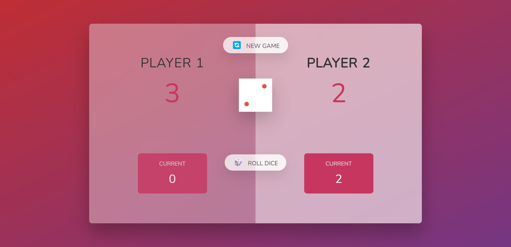

# Dice Game

In this there are 2 player and every time when player roll a dice the dice value will be add in the player score.If any player score is more that 100 that player has won the match and if dice value will 1 then next player will get chnace.

## Deployment

To deploy this project run

Download the code from my repository and run the Index.html file

## Features

1.User can roll the dice manually

2.User can win if score in more than 100

3.reset functionality 

## Contribution

Any feature requests and pull requests are welcome!

